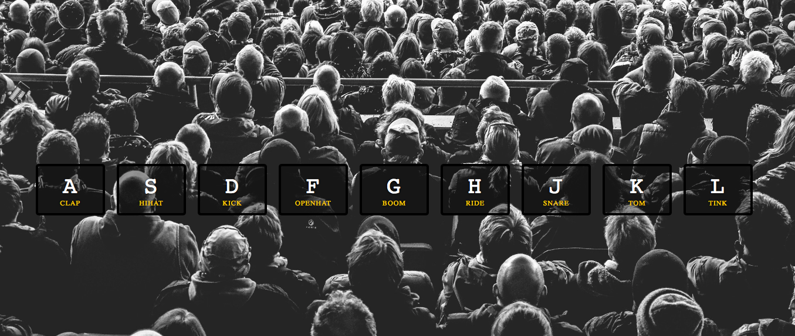

Lessons Learned From This Project 
==================================

## HTML
---
1. [**`<kbd>`**](https://developer.mozilla.org/en-US/docs/Web/HTML/Element/kbd) Keybord input element 

    ```Html
    <kbd>A</kbd>
    ```
2. [**data-***](https://developer.mozilla.org/tr/docs/Web/HTML/Global_attributes/data-*) Custom data attribute
    
    Custom data attributes gives us the ability to assign a specific data to the specific html element

    ```Html
    <div data-key="65" class="key"></div>
    ```
    
## CSS
---
1. [**display: flex**](https://css-tricks.com/snippets/css/a-guide-to-flexbox/) Flexbox

    ```Css
    .keys {
        display: flex
    }
    ```
2. [**Css Units**](https://developer.mozilla.org/en-US/docs/Learn/CSS/Building_blocks/Values_and_units)

    **em:** Unit inhereted from parent element. For example, if there is a `<div>` element with `font-size: 16px;` 1em for its child elements will be equal to 16px.

    **rem:** Unit type like em with difference that rem inherits unit size from root element.
    ```Css
    border-radius: .5rem;
    ```

    **vh:** %1 height of the wiewport
    ```Css
    min-height: 100vh;
    ```
    **vw:** %1 width of the wiewport

3. [**transition**](https://developer.mozilla.org/en-US/docs/Web/CSS/transition) Enables to define transition between two state of an element
    
    transition: transition-property, transition-duration, transition-timing-function, transition-delay.
    ```Css
    transition: all .07s ease;
    ```

4. [**transform**](https://developer.mozilla.org/en-US/docs/Web/CSS/transform) This property allows you to rotate, scale, transform or skew the element.

## JavaScript and DOM
---

1. [**Document.querySelectorAll(selector)**](https://developer.mozilla.org/en-US/docs/Web/API/Document/querySelectorAll)

    This method returns a NodeList which contains elements inside the document matched with the specified css selector. `Array.from` method is used to convert NodeList to array.

    ```JavaScript
    const keys = Array.from(document.querySelectorAll('.key'));
    ```

2. [**Document.querySelector()**](https://developer.mozilla.org/en-US/docs/Web/API/Document/querySelector)

    Returns the _first maching element_ with the specified css selector

3. [**EventTarget.addEventListener()**](https://developer.mozilla.org/en-US/docs/Web/API/EventTarget/addEventListener)

    This method sets up a function when a specified event is triggered. As in the example below; `playSound` function will be called when `keydown` event is triggered in window object(browser)

    ```JavaScript
    window.addEventListener('keydown', playSound);
    ```

4. [**Element.classList**](https://developer.mozilla.org/en-US/docs/Web/API/Element/classList)

    This property returns the all class attributes of the element. We can add or remove class attributes to the element with `add()` and `remove()` methods.

    ```JavaScript
    key.classList.add('playing');
    ```