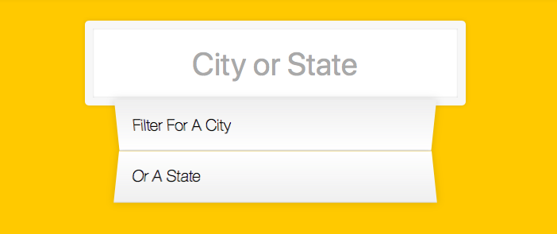

Lessons Learned From This Project 
==================================

## HTML
---
--

    
## CSS
---

1. [**perspective**](https://www.w3schools.com/cssref/css3_pr_perspective.asp)
    The perspective property defines how far the object is away from the user. So, a lower value will result in a more intensive 3D effect than a higher value
    ```Css
    .div {
        transform: perspective(50px);
    }
    ```

## JavaScript and DOM
---

1. [**fetch**](https://developer.mozilla.org/en-US/docs/Web/API/Fetch_API/Using_Fetch)

    Fetch api provides a an interface for making requests from a source. Fetch returns a `Promise`. One of the best explanation for fetch api click the [video](https://www.youtube.com/watch?v=cuEtnrL9-H0)


    ```JavaScript

    fetch('url_to_an_api')
        .then(response => response.json())
        .then(data => console.log(data));
    }
    ```

2. [**match**](https://developer.mozilla.org/en-US/docs/Web/JavaScript/Reference/Global_Objects/String/match)

    The `match` method retrieves the result of matching a string against a regular expression.

3. [**RegExp**](https://developer.mozilla.org/en-US/docs/Web/JavaScript/Reference/Global_Objects/RegExp)

    Creates a new regular expression object

    `\B` Not word boundary.
    `(?=)` Positive lookahead.
    The syntax is: X(?=Y), it means "look for X, but match only if followed by Y".
    `(?!)` Negative lookahead.
    The syntax is: X(?!Y), it means "search X, but only if not followed by Y".
    For more information about [lookahead and lookbehind](https://javascript.info/regexp-lookahead-lookbehind)
    `\d{3}+` Digit with 3 numbers one or more
