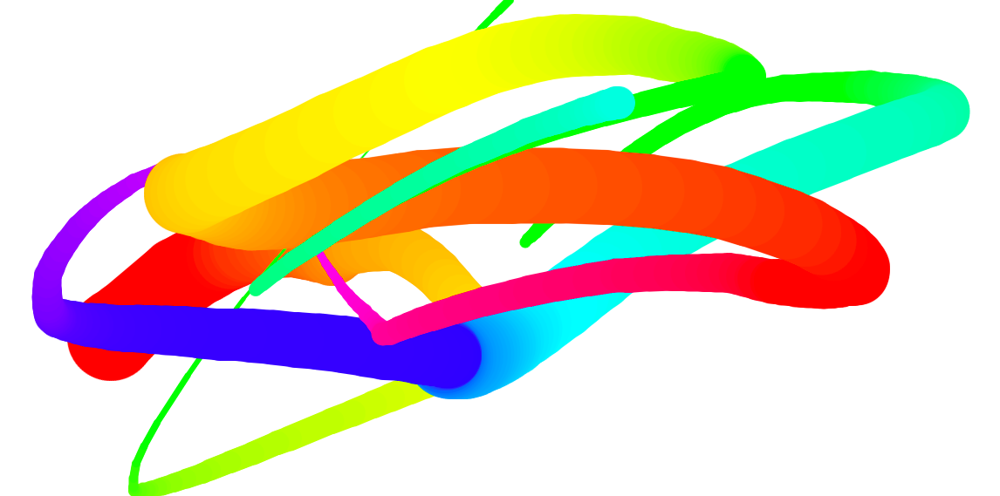

Lessons Learned From This Project 
==================================

## HTML
---
1. [**canvas**](https://www.w3schools.com/html/html5_canvas.asp) element used to draw graphics on a web page.

    ```Html
    <canvas id="myCanvas" width="200" height="100"></canvas>
    ```

## JavaScript
---

1. [**HTMLCanvasElement.getContext**](https://developer.mozilla.org/en-US/docs/Web/API/HTMLCanvasElement/getContext)

    Returns a drawing context on the canvas
    - "2d", leading to the creation of a CanvasRenderingContext2D object representing a two-dimensional rendering context

2. [**CanvasRenderingContext2D.strokeStyle**](https://developer.mozilla.org/en-US/docs/Web/API/CanvasRenderingContext2D/strokeStyle)
    
    Property of the Canvas 2D API specifies the color, gradient, or pattern to use for the strokes (outlines) around shapes. The default is #000 (black).

3. [**CanvasRenderingContext2D.lineJoin**](https://developer.mozilla.org/en-US/docs/Web/API/CanvasRenderingContext2D/lineJoin)

    Property of the Canvas 2D API determines the shape used to join two line segments where they meet. round, bevel or miter.

4. [**CanvasRenderingContext2D.lineCap**](https://developer.mozilla.org/en-US/docs/Web/API/CanvasRenderingContext2D/lineCap)
    
    Property of the Canvas 2D API determines the shape used to draw the end points of lines. butt, round or square

5. [**CanvasRenderingContext2D.beginPath**](https://developer.mozilla.org/en-US/docs/Web/API/CanvasRenderingContext2D/beginPath)
    
    Method of the Canvas 2D API starts a new path by emptying the list of sub-paths.

    ```JavaScript
    ctx.beginPath();
    ```
6. [**CanvasRenderingContext2D.moveTo**](https://developer.mozilla.org/en-US/docs/Web/API/CanvasRenderingContext2D/moveTo)

    Method of the Canvas 2D API begins a new sub-path at the point specified by the given (x, y) coordinates

7. [**CanvasRenderingContext2D.lineTo**](https://developer.mozilla.org/en-US/docs/Web/API/CanvasRenderingContext2D/lineTo)

    Adds a straight line to the current sub-path by connecting the sub-path's last point to the specified (x, y) coordinates.
    Like other methods that modify the current path, this method does not directly render anything. To draw the path onto a canvas, you can use the fill() or stroke() methods.