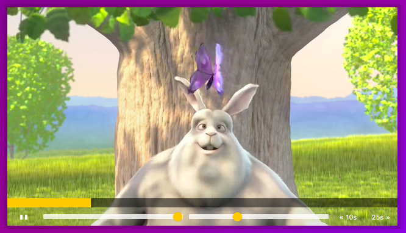

Lessons Learned From This Project 
==================================

## HTML
---
1. [**video**](https://www.w3schools.com/html/html5_video.asp) Shows a video in HTML

    ```Html
    <video width="320" height="240" controls>
        <source src="movie.mp4" type="video/mp4">
        <source src="movie.ogg" type="video/ogg">
        Your browser does not support the video tag.
    </video>
    ```

## CSS
---
1. [**`::-webkit-slider-runnable-track`**](https://developer.mozilla.org/en-US/docs/Web/CSS/::-webkit-slider-runnable-track)
    CSS pseudo-element represents the "track" (the groove in which the indicator slides) of an `<input type="range">`.
    <input type="range">
    Similar -> **::moz-range-track**

2. [**`::-webkit-slider-thumb`**](https://developer.mozilla.org/en-US/docs/Web/CSS/::-webkit-slider-thumb)
    CSS pseudo-element represents the "thumb" that the user can move within the "groove" of an `<input>` of type="range".
    Similar -> **::-moz-range-thumb**

## JavaScript
---

1. [**Ternary Operator ?**](https://developer.mozilla.org/en-US/docs/Web/JavaScript/Reference/Operators/Conditional_Operator)

    condition ? exprIfTrue : exprIfFalse
    ```JavaScript
    var age = 26;
    var beverage = (age >= 21) ? "Beer" : "Juice";
    console.log(beverage); // "Beer"
    ```

2. [**Node.TextContent**](https://developer.mozilla.org/en-US/docs/Web/API/Node/textContent)
    
    Represents the text content of the node and its desendants.
    ```Html
    <div id="divA">This is <span>some</span> text!</div>
    ```
    ```JavaScript
    let text = document.getElementById('divA').textContent;
    // The text variable is now: 'This is some text!'
    ```

3. **&& Operator**

    Shorthand for only if conditional statement
    ```Javascript
    if(condition) {
        action;
    }
    ````
    is equal to
    ```condition && action```